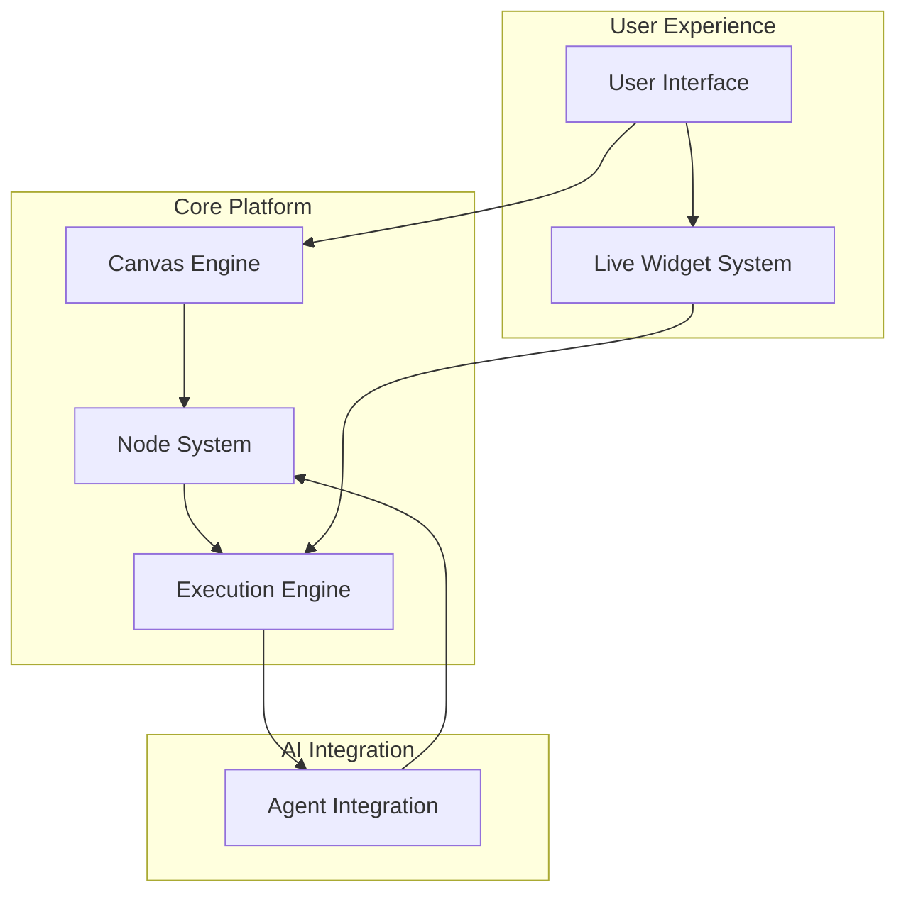

# Node Flow - Technical Specifications

This document provides an overview of all technical specifications for the Node Flow platform. Each specification covers a critical domain of the system architecture and implementation.

## 📋 Specification Overview

Node Flow is a revolutionary node-based code execution platform that combines visual workflow creation with real-time interactivity and AI agent integration. The platform enables users and agents to create, execute, and monitor complex workflows through an intuitive interface with live widget feedback.

## 🏗️ Architecture Specifications

| Domain | File | Description | Status |
|--------|------|-------------|--------|
| **System Architecture** | [architecture.md](./specs/architecture.md) | High-level system design, technology stack, and component interactions | ✅ Complete |
| **Node System** | [node-system.md](./specs/node-system.md) | Node types, interfaces, execution lifecycle, and extensibility framework | ✅ Complete |
| **Live Widgets** | [live-widgets.md](./specs/live-widgets.md) | Real-time widget system, data binding, and interactive components | ✅ Complete |
| **Execution Engine** | [execution-engine.md](./specs/execution-engine.md) | Workflow orchestration, stream processing, and distributed execution | ✅ Complete |
| **Agent Integration** | [agent-integration.md](./specs/agent-integration.md) | AI agent workflows, multi-agent coordination, and autonomous capabilities | ✅ Complete |
| **User Interface** | [user-interface.md](./specs/user-interface.md) | Canvas editor, multi-view system, and interaction patterns | ✅ Complete |

## 🎯 Core Principles

### Agent-Native Design
The platform is designed with AI agents as primary users, enabling autonomous workflow creation, modification, and optimization without human intervention.

### Real-Time Interactivity
Live widgets provide immediate visual feedback during workflow execution, creating an immersive development and monitoring experience.

### Visual Programming
Node-based interface with drag-and-drop functionality makes complex workflow creation accessible to both technical and non-technical users.

### Scalable Architecture
Distributed, event-driven system designed to handle thousands of concurrent workflows with sub-100ms response times.

## 🔄 System Integration

The specifications are designed to work together as a cohesive system:

## 📈 Development Phases

### Phase 1: Core Platform (Q2 2024)
- Basic node system and execution engine
- Canvas editor with drag-and-drop functionality
- Simple widget framework
- Local execution runtime

### Phase 2: Live Widgets (Q3 2024)
- Real-time data binding and updates
- Interactive widget components
- Multi-view system implementation
- Performance optimization

### Phase 3: Agent Integration (Q4 2024)
- AI agent workflow creation
- Multi-agent coordination
- LLM integration patterns
- Agent marketplace foundation

### Phase 4: Scale & Polish (Q1 2025)
- Distributed execution system
- Enterprise features and security
- Advanced debugging tools
- Performance monitoring

## 🛠️ Technology Stack Summary

### Frontend
- **Canvas**: Custom WebGL renderer with infinite zoom/pan
- **Widgets**: React components with real-time data binding
- **State**: Event-sourced architecture with Redux Toolkit
- **Communication**: WebSocket for real-time updates

### Backend
- **Runtime**: Node.js/TypeScript with worker threads
- **Database**: PostgreSQL for workflows, Redis for real-time state
- **Messaging**: Apache Kafka for event streaming
- **API**: GraphQL with real-time subscriptions

### Infrastructure
- **Containers**: Docker with Kubernetes orchestration
- **Monitoring**: Prometheus + Grafana for metrics
- **Security**: JWT authentication, role-based access control
- **CI/CD**: GitHub Actions with automated testing

## 📚 Additional Documentation

- **API Documentation**: Available after implementation
- **Developer Guide**: Coming with Phase 1 release
- **User Manual**: Available with Phase 2 release
- **Contributing Guide**: See [CONTRIBUTING.md](./CONTRIBUTING.md)

## 🎯 Success Metrics

- **Performance**: Sub-100ms widget updates, 10K+ concurrent workflows
- **Usability**: 90%+ user satisfaction, <5 minute time-to-first-workflow
- **Adoption**: 1000+ active workflows within 6 months
- **Agent Integration**: 80%+ of workflows created/modified by AI agents

---

These specifications serve as the foundation for building Node Flow. Each document provides detailed technical requirements, implementation guidelines, and integration patterns necessary for successful development.

For questions or clarifications on any specification, please refer to the individual documents or reach out to the development team.
