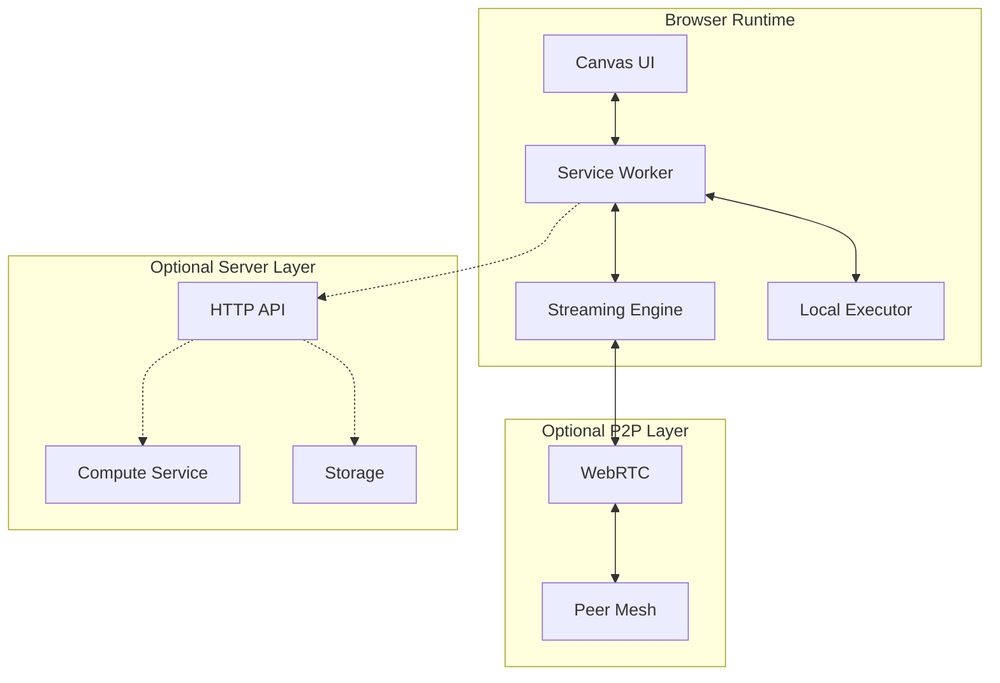
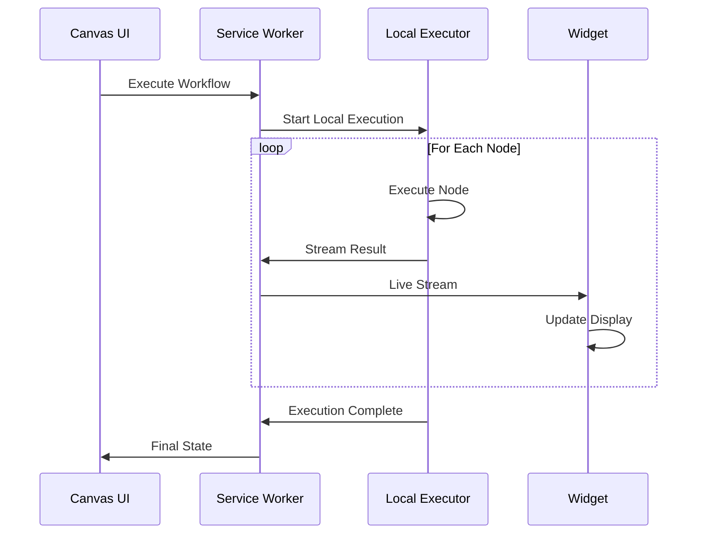
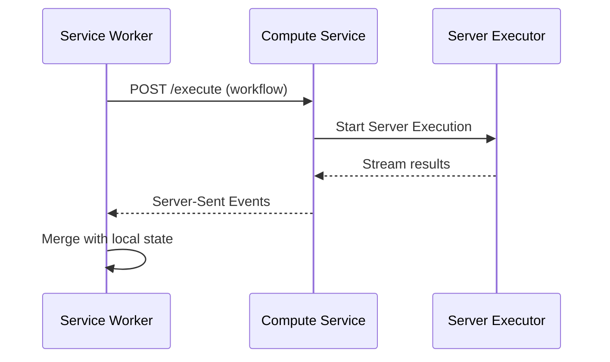
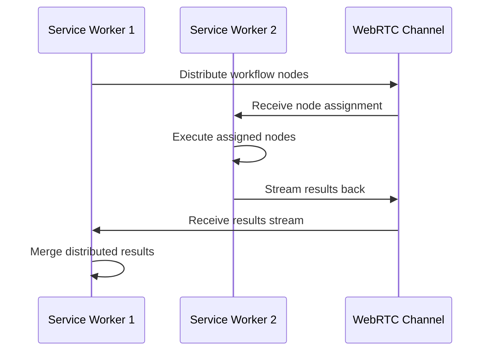

# Node Flow Architecture Specification

## 1. High-Level System Architecture

Node Flow follows a **browser-first, streaming architecture** optimized for real-time visual workflow execution. The system starts minimal in the browser and scales through well-defined interfaces to server-side execution when needed.



### Core Design Principles

- **Browser-First**: Starts completely in-browser, scales to server when needed
- **Streaming Native**: Direct streaming for inference, tool calls, and real-time updates
- **Progressive Enhancement**: Clean interfaces allow seamless scaling
- **Minimal Footprint**: Start simple, grow through well-defined boundaries
- **Connection Agnostic**: Works offline, P2P, or server-connected

## 2. Frontend Architecture

### Canvas Engine

Lightweight, GPU-accelerated node editor that runs entirely in the browser with streaming-first design.

```typescript
// Minimal Canvas Architecture
interface CanvasEngine {
  renderer: Canvas2DRenderer | WebGLRenderer; // Progressive enhancement
  viewport: ViewportController;
  nodes: NodeManager;
  connections: ConnectionManager;
  streaming: StreamingInterface;
}

// Streaming-First Node System
interface StreamingNodeSystem {
  registry: Map<string, NodeFactory>;
  executor: LocalExecutor;
  streamer: NodeStreamer;
  serializer: WorkflowSerializer;
}
```

**Key Features:**

- **Progressive Rendering**: Start with Canvas 2D, upgrade to WebGL when needed
- **Streaming Execution**: Nodes stream results directly to connected nodes
- **Incremental Updates**: Only re-render changed regions
- **Offline-First**: Full functionality without server connection
- **Memory Efficient**: Lazy loading and cleanup of inactive workflows

### Streaming Widget System

Reactive widget system that streams data directly from executing nodes with minimal overhead.

```typescript
// Streaming Widget Architecture
interface StreamingWidget {
  id: string;
  nodeId: string;
  stream: ReadableStream<any>;
  render: (data: any) => ReactElement;
  dispose: () => void;
}

// Widget Stream Factory
interface WidgetStreamer {
  createStream(nodeId: string): ReadableStream<any>;
  subscribeToNode(nodeId: string, widget: StreamingWidget): void;
  cleanup(widgetId: string): void;
}
```

**Features:**

- **Direct Streaming**: Widgets receive data directly from node execution streams
- **Zero Latency**: No intermediate buffers or event systems
- **Automatic Cleanup**: Streams automatically dispose when nodes complete
- **Backpressure Handling**: Built-in flow control for high-throughput data

### Service Worker Runtime

Service Worker-based execution engine that handles workflow state and provides clean scaling interfaces.

```typescript
// Service Worker Runtime
interface ServiceWorkerRuntime {
  executor: WorkflowExecutor;
  streamer: StreamingEngine;
  storage: LocalStorage;
  scaling: ScalingInterface;
}

// Streaming State Management
interface StreamingState {
  workflow: WorkflowStream;
  execution: ExecutionStream;
  connections: Map<string, ReadableStream>;
  subscriptions: Set<StreamSubscription>;
}

// Clean Scaling Interface
interface ScalingInterface {
  canScale(): boolean;
  scaleToServer(workflow: Workflow): Promise<ServerExecution>;
  scaleToP2P(workflow: Workflow): Promise<P2PExecution>;
  fallbackToLocal(): Promise<LocalExecution>;
}
```

## 3. Optional Server Architecture

### Compute Service (Optional Enhancement)

Lightweight compute service that accepts workflows from Service Workers when local execution isn't sufficient.

```typescript
// Minimal Server Interface
interface ComputeService {
  execute(workflow: SerializedWorkflow): AsyncIterable<ExecutionUpdate>;
  health(): Promise<ServerHealth>;
  capabilities(): Promise<ServerCapabilities>;
}

// Server-Side Execution
interface ServerExecution {
  id: string;
  workflow: SerializedWorkflow;
  stream: ReadableStream<ExecutionUpdate>;
  cancel(): Promise<void>;
}

// Progressive Enhancement Interface
interface ServerCapabilities {
  maxNodes: number;
  supportedNodeTypes: string[];
  features: ServerFeature[];
  estimatedLatency: number;
}
```

**Design Features:**

- **Stateless by Design**: Server holds no persistent state
- **Streaming Native**: All responses are streams, no request/response
- **Optional Enhancement**: Browser works fully without server
- **Auto-Scaling Ready**: Designed for serverless deployment

### WebRTC P2P Layer (Optional)

Peer-to-peer execution layer for distributed workflows without server infrastructure.

```typescript
// P2P Execution Interface
interface P2PExecution {
  mesh: PeerMesh;
  coordinator: P2PCoordinator;
  discovery: PeerDiscovery;
  security: P2PSecurityManager;
}

// Peer Mesh Management
interface PeerMesh {
  connect(peerId: string): Promise<RTCPeerConnection>;
  broadcast(message: P2PMessage): Promise<void>;
  route(nodeId: string): Promise<string>; // Returns peerId
  distribute(workflow: Workflow): Promise<DistributionMap>;
}

// P2P Coordination
interface P2PCoordinator {
  electLeader(): Promise<string>;
  synchronizeState(state: WorkflowState): Promise<void>;
  handlePeerFailure(peerId: string): Promise<void>;
}
```

### Node System

Simple, extensible node registry with clean plugin interfaces.

```typescript
// Minimal Node System
interface NodeRegistry {
  register(type: string, factory: NodeFactory): void;
  create(type: string, config: NodeConfig): Promise<Node>;
  list(): NodeType[];
}

// Node Interface
interface Node {
  id: string;
  type: string;
  execute(input: any): AsyncIterable<any>;
  validate?(input: any): ValidationResult;
  dispose?(): void;
}

// Plugin System (Future Extension Point)
interface PluginInterface {
  load(source: string): Promise<NodeRegistry>;
  unload(pluginId: string): Promise<void>;
  sandbox?: PluginSandbox; // Optional security layer
}
```

## 4. Streaming Protocols

### Native Streaming Architecture

All communication uses native Web Streams API for consistent, backpressure-aware data flow.

```typescript
// Unified Streaming Interface
interface StreamingProtocol {
  createWorkflowStream(workflow: Workflow): ReadableStream<ExecutionUpdate>;
  createNodeStream(nodeId: string): ReadableStream<NodeOutput>;
  createWidgetStream(widgetId: string): ReadableStream<WidgetData>;
  bridgeToServer?(stream: ReadableStream): ReadableStream; // Optional server bridge
  bridgeToP2P?(stream: ReadableStream, peers: string[]): ReadableStream; // Optional P2P bridge
}

// Stream Message Format
interface StreamMessage {
  id: string;
  timestamp: number;
  type: "node-output" | "execution-update" | "widget-data" | "error";
  data: any;
  metadata?: StreamMetadata;
}
```

### Server Communication (Optional)

Simple HTTP streaming when server enhancement is available.

```typescript
// Minimal Server Protocol
interface ServerProtocol {
  executeWorkflow(
    workflow: SerializedWorkflow
  ): ReadableStream<ExecutionUpdate>;
  health(): Promise<Response>;
  capabilities(): Promise<Response>;
}

// HTTP Streaming Format
// POST /execute -> Server-Sent Events stream
// GET /health -> JSON response
// GET /capabilities -> JSON response
```

### WebRTC Protocol (Optional)

Direct peer-to-peer streaming for distributed execution.

```typescript
// P2P Protocol
interface P2PProtocol {
  discoverPeers(): Promise<PeerInfo[]>;
  connectToPeer(peerId: string): Promise<RTCDataChannel>;
  streamToPeer(stream: ReadableStream, peerId: string): Promise<void>;
  broadcastStream(stream: ReadableStream): Promise<void>;
}

// P2P Message Format
interface P2PMessage {
  type:
    | "workflow-distribute"
    | "node-execute"
    | "result-stream"
    | "peer-status";
  sender: string;
  data: any;
  streamId?: string;
}
```

## 5. Execution Flow

### Browser-First Execution



### Server Scaling Flow



### P2P Distribution Flow



## 6. Progressive Scaling

### Scaling Strategy

The architecture supports multiple scaling approaches through clean interfaces:

1. **Local-First**: Everything runs in browser Service Worker
2. **P2P Enhancement**: WebRTC for peer-to-peer distributed execution
3. **Server Enhancement**: Optional compute service for heavy workloads
4. **Hybrid Scaling**: Mix of local, P2P, and server execution

### Browser Resource Management

```typescript
// Local Resource Constraints
interface BrowserLimits {
  maxConcurrentNodes: number; // Based on available CPU cores
  memoryThreshold: number; // Trigger server scaling
  executionTimeout: number; // Local execution timeout
  streamBufferSize: number; // Backpressure management
}

// Scaling Decision Engine
interface ScalingDecision {
  shouldScaleToServer(workflow: Workflow): boolean;
  shouldUseP2P(workflow: Workflow, peers: PeerInfo[]): boolean;
  canRunLocally(workflow: Workflow): ResourceCheck;
}
```

### Server Scaling (Optional)

When server scaling is available, it follows serverless patterns:

- **Stateless Execution**: No persistent state on server
- **Auto-scaling**: Scales based on incoming workflow requests
- **Stream-First**: All communication via streams, no polling
- **Edge Deployment**: Deploy close to users for minimal latency

## 7. Security Model

### Browser-First Security

Security is built into the browser platform with additional layers for scaling:

- **Origin Isolation**: Service Workers provide natural security boundaries
- **CSP Headers**: Content Security Policy prevents code injection
- **Credential Management**: Web Credential API for secure token storage
- **HTTPS Everywhere**: All external communication over HTTPS

### Node Execution Security

```typescript
// Minimal Security Interface
interface NodeSecurity {
  validateInput(input: any): ValidationResult;
  sanitizeOutput(output: any): any;
  checkPermissions(node: Node, context: ExecutionContext): boolean;
}

// Optional Plugin Sandboxing (Future Enhancement)
interface PluginSandbox {
  executeInSandbox(code: string): Promise<any>;
  limitResources(limits: ResourceLimits): void;
  restrictAPIs(allowedAPIs: string[]): void;
}
```

### P2P Security (When Used)

- **WebRTC Encryption**: Built-in DTLS encryption for peer connections
- **Peer Authentication**: Challenge-response authentication between peers
- **Data Validation**: All peer data validated before processing
- **Network Isolation**: Peers can only communicate through defined channels

## 8. Technology Stack

### Core Browser Stack

| Technology      | Version | Rationale                                |
| --------------- | ------- | ---------------------------------------- |
| TypeScript      | 5+      | Type safety across entire stack          |
| Web Streams API | Native  | Foundation for streaming architecture    |
| Service Workers | Native  | Background execution and offline support |
| Canvas 2D/WebGL | Native  | Progressive rendering enhancement        |
| IndexedDB       | Native  | Local data persistence                   |
| WebRTC          | Native  | Optional P2P capabilities                |

### Development Stack

| Technology | Version | Rationale                           |
| ---------- | ------- | ----------------------------------- |
| React      | 18+     | Component model for widgets and UI  |
| Vite       | 5+      | Fast development and building       |
| Vitest     | 1+      | Fast unit testing aligned with Vite |
| Playwright | 1+      | End-to-end testing                  |
| ESLint     | 8+      | Code quality and consistency        |
| Prettier   | 3+      | Code formatting                     |

### Optional Server Stack (Enhancement)

| Technology         | Version | Rationale                    |
| ------------------ | ------- | ---------------------------- |
| Node.js            | 20+     | Shared language with browser |
| Fastify            | 4+      | Lightweight HTTP server      |
| Server-Sent Events | Native  | Simple streaming from server |
| Docker             | 24+     | Deployment containerization  |

### Infrastructure (Optional)

| Technology         | Version | Rationale                           |
| ------------------ | ------- | ----------------------------------- |
| Cloudflare Workers | Latest  | Edge deployment for compute service |
| Vercel             | Latest  | Static hosting with edge functions  |
| Railway/Fly.io     | Latest  | Simple server deployment            |

## Architecture Decision Records

### ADR-001: Browser-First Architecture

**Decision**: Start with Service Worker-based execution, scale through interfaces
**Rationale**: Minimize complexity, reduce infrastructure requirements, enable offline use
**Trade-offs**: Limited compute vs. simplified deployment and scaling

### ADR-002: Streaming-Native Communication

**Decision**: Use Web Streams API for all data flow instead of event systems
**Rationale**: Built-in backpressure, consistent patterns, direct node-to-widget streaming
**Trade-offs**: Streaming complexity vs. real-time performance and consistency

### ADR-003: Progressive Enhancement Scaling

**Decision**: Clean interfaces for optional server and P2P scaling
**Rationale**: Start minimal, scale when needed without architectural rewrites
**Trade-offs**: Interface complexity vs. flexible scaling options

### ADR-004: Canvas 2D to WebGL Progression

**Decision**: Start with Canvas 2D, upgrade to WebGL when needed
**Rationale**: Faster MVP development while maintaining performance upgrade path
**Trade-offs**: Two rendering paths vs. progressive enhancement

This architecture delivers a **minimal, pragmatic foundation** that can scale through well-defined interfaces while avoiding over-engineering for features that may not be needed initially.
